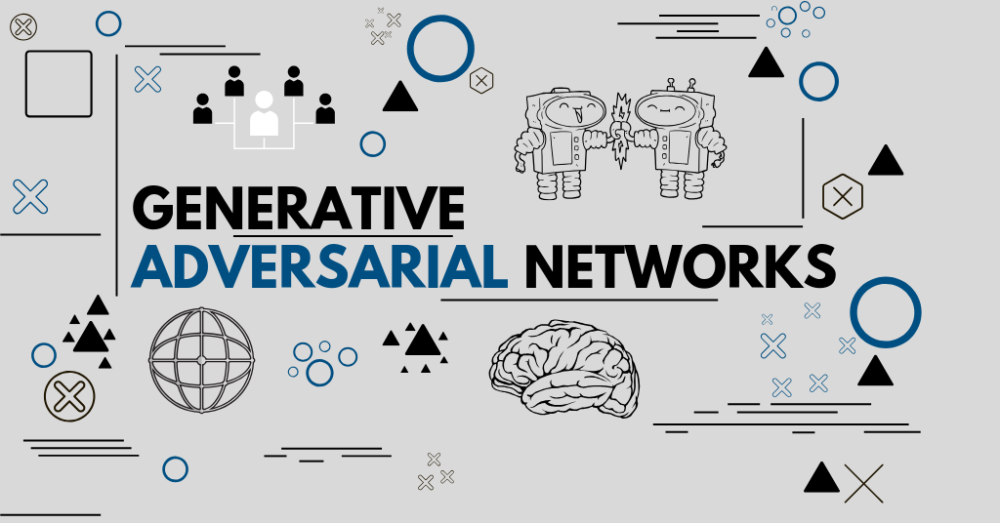

GAN (Generative Adversarial Networks) Repository

Welcome to the GAN (Generative Adversarial Networks) repository! This repository is a comprehensive resource for understanding and implementing GANs, a fascinating class of machine learning models used for generative tasks.

## Table of Contents

1. [About GANs](#about-gans)
2. [Contents](#contents)
3. [Installation](#installation)
4. [Usage](#usage)
5. [Contributing](#contributing)
6. [License](#license)

## About GANs

Generative Adversarial Networks (GANs) are a class of neural networks introduced by Ian Goodfellow and his colleagues in 2014. GANs consist of two neural networks, a generator and a discriminator, which are trained in an adversarial manner. The generator aims to create data that is indistinguishable from real data, while the discriminator attempts to distinguish between real and fake data.

## Contents

This repository contains a wealth of information and resources related to GANs, including but not limited to:

- Detailed explanations of GAN concepts and principles.
- Various GAN architectures and their implementations.
- Hands-on tutorials and code examples.
- Datasets suitable for GAN training.
- Evaluation metrics for assessing GAN performance.
- Real-world applications and use cases of GANs.

Feel free to explore the repository's contents to learn more about GANs and how to use them effectively.

## Installation

To get started with the code and implementations in this repository, you'll need to follow the installation instructions provided in the specific project directories. We recommend using virtual environments to manage dependencies.

## Usage

Each project or implementation in this repository may have its own usage instructions. Please refer to the individual project directories for details on how to run and use the code provided.

## Contributing

We welcome contributions from the community! If you'd like to contribute to this repository by adding new content, fixing issues, or improving existing materials, please check our [Contribution Guidelines](CONTRIBUTING.md).

## License

This repository is licensed under the GNU Public V3.

Happy learning and experimenting with GANs!
